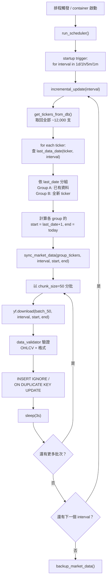
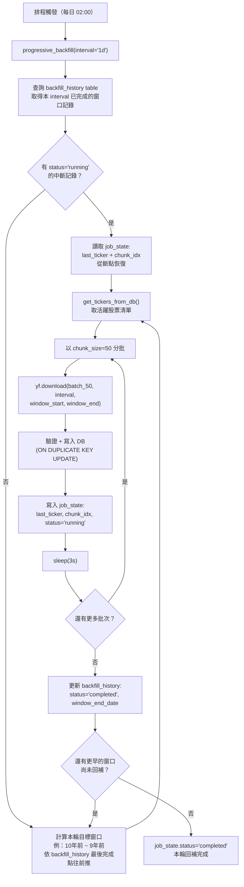

# 資料同步修正計畫書

> **修訂日期：** 2026-04-03  
> **適用範圍：** Stock AI Filter PRO — data_sync 模組全鏈路  
> **依據來源：** old_data_source.md、new_data_source.md、資料來源與API分析報告.md、以及實際程式碼  
> **本文目的：** 將現行系統在歷史回補、增量更新、缺口填補三大場景中的問題逐一列出，並給出具體修正方案、風險評估與預估時間

---

## 壹、現況盤點

### 1.1 各程式碼功能說明

以下列出 data_sync 相關所有檔案的角色與關鍵行為。

#### `scheduler.py` — 排程管理（APScheduler）

| 任務 ID | 排程時間 | 呼叫函式 | 目前傳入 interval | 說明 |
|---------|---------|---------|------------------|------|
| `incremental_update` | 週一～週五 18:00 | `incremental_update(interval='1d')` | `1d` | 補當日增量 |
| `progressive_backfill` | 每日 02:00 | `progressive_backfill(interval='1d')` | `1d` | 逐步往前回補（每次 5 年） |
| `gap_scanner` | 週日 03:00 | `ensure_data(['all'], '1d', '2024-01-01', None)` | `1d` | 補完整度不足區間 |
| `backup_user_data` | 每日 23:55 | `backup_user_data()` | — | 使用者資料備份 |
| `backup_market_data` | 每日 23:59 | `backup_market_data()` | — | 市場資料備份 |

**問題：** 只有 `1d` 被排入排程；`1m/5m/1h` 完全沒有自動任務。`ensure_data` 傳入 `['all']` 不是真實 ticker 清單，會造成邏輯錯誤。

#### `config.py` — 速率限制與排程設定

```python
RATE_LIMIT_CONFIG = {
    'chunk_size': 20,            # 每批同時下載幾支股票
    'batch_delay_seconds': 5,    # 批次間延遲（秒）
    'max_daily_downloads': 500,  # 單次 sync_market_data 呼叫最多處理幾支 ticker
    'retry_attempts': 3,
    'retry_backoff': [5, 15, 60] # 第 1/2/3 次重試等待秒數
}

TIMEFRAME_SETTINGS = {
    '1d': {'period_limit': 'max',  'desc': 'Full History'},
    '1h': {'period_limit': '2y',   'desc': 'Rolling 2 Years'},
    '5m': {'period_limit': '60d',  'desc': 'Rolling 60 Days'},
    '1m': {'period_limit': '7d',   'desc': 'Rolling 7 Days'}
}
```

**注意：** `max_daily_downloads=500` 是「單次呼叫 ticker 上限」，不是全域日限額。全市場 12,000+ 檔一次跑不完。

#### `sync_market_data.py` — 核心下載引擎

| 函式 | 用途 | 關鍵行為 |
|------|------|---------|
| `get_tickers_from_db(market)` | 從 `stock_meta` 取得 Active ticker 清單 | 排除 `status='Delisted'` |
| `get_last_data_date(symbol, interval)` | 查某檔某 timeframe 最新 datetime | 用於增量更新起點判斷 |
| `check_data_completeness(symbol, interval, start, end)` | 計算完整度（0.0~1.0） | multiplier 只定義 1h/5m/1m；其餘預設 1 |
| `insert_ticker_data(cursor, symbol, df, interval)` | 寫入 `market_data_ohlcv`（ON DUPLICATE KEY UPDATE） | 逐筆解析 + 寫入 |
| `download_chunk(cursor, tickers, interval, period, start, end)` | 下載一批 ticker（含重試 3 次） | 失敗寫 `download_failures` |
| `sync_market_data(tickers, interval, period, start, end)` | 最頂層下載入口 | 超過 `max_daily_downloads` 會被截斷 |
| `incremental_update(interval)` | 增量更新策略 | 全部 ticker 查最後日期 → 分組 → 分批下載 |
| `progressive_backfill(interval)` | 歷史回補策略 | 每次往前 5 年，最遠 20 年；完成後寫 `backfill_history` |
| `ensure_data(tickers, interval, start, end)` | 缺口補填策略 | 完整度 < 0.9 才補；由外部傳入 ticker 清單 |

#### `data_validator.py` — OHLCV 資料品質驗證

| 函式 | 用途 |
|------|------|
| `validate_market_data(df)` | 回傳 `(bool, str)`；驗證欄位完整、價格>0、High≥Low、High=max(O,C)、Low=min(O,C) |

- 用途：`download_chunk()` 在寫入 DB 前呼叫此函式做品質閘門。
- 失敗時：將該 ticker 寫入 `download_failures` 並跳過此批。
- 注意：目前不驗證 `Volume`（負數或零 volume 會通過）。

#### `gap_scanner.py` — 時間序列缺口掃描

| 函式 | 用途 |
|------|------|
| `scan_gaps(tickers, interval, auto_fill)` | 逐檔查詢時間序列，相鄰差 > 7 天視為缺口，寫入 `data_gaps` |

- `GAP_THRESHOLD = timedelta(days=7)` 是固定值。
- 可選 `auto_fill=True` 自動呼叫 `sync_market_data` 補缺口。
- **問題：** 7 天門檻對分K資料太寬鬆（1h 資料連續 7 天無資料很不合理但不被偵測）。

#### `market_data.py` — 圖表 K 線查詢 API

| 端點 | 用途 | 重採樣能力 |
|------|------|-----------|
| `GET /api/stocks` | 回傳股票清單（含 market/status 過濾） | — |
| `GET /api/market-data/{symbol}` | 回傳 K 線資料 | 只有 `1w→W-MON`、`1M→MS`、`1y→YS`（均從 1d 重採樣） |
| `GET /api/market-data/kline-count` | 回傳區間 K 棒數量 | 委託 `screening/indicators/service.py` 處理 |

- **問題：** 缺少 `3m`（從 1m）、`15m`（從 5m）、`30m`（從 5m）、`4h`（從 1h）的重採樣邏輯。
- 前端有這些按鈕，但圖表會顯示空白。

#### `fetch_tickers.py` — 股票主清單下載

| 函式 | 用途 |
|------|------|
| `fetch_listed_tickers()` | 從 NASDAQ Trader 下載 Listed 股票（NASDAQ/NYSE/AMEX） |
| `fetch_otc_tickers()` | 從 NASDAQ Trader 下載 OTC 股票 |
| `update_tickers()` | 合併 + 去重 + upsert 至 `stock_meta` |

- 範圍：包含 OTC。
- 估算：Listed 約 6,000～8,000 支、OTC 約 10,000～15,000 支。

#### `fetch_basis_data.py` — 手動全週期基礎補齊腳本

| 函式 | 用途 |
|------|------|
| `fetch_and_store_spy()` | 僅下載 SPY 所有週期（1d/1h/30m/15m/5m/1m）最大歷史 |
| `fetch_all_existing_basis()` | 對 DB 內所有現有 ticker 補齊各週期歷史 |

- 支援的週期與 yfinance period 上限：

```python
FETCH_CONFIG = {
    "1d":  "max",    # 全歷史
    "1h":  "730d",   # 滾動 2 年
    "30m": "60d",    # 滾動 60 天
    "15m": "60d",    # 滾動 60 天
    "5m":  "60d",    # 滾動 60 天
    "1m":  "7d",     # 滾動 7 天
}
```

- **注意：** 此腳本獨立於排程，需手動 `python fetch_basis_data.py --mode all` 執行。
- 批次設定：`batch_size=20`、`batch_delay=15s`、`interval_delay=60s`（比排程更保守）。

#### `screening/indicators/service.py` — 篩選指標 interval 映射與重採樣

```python
INTERVAL_TO_DB = {
    "1D": "1d", "1W": "1d", "1M": "1d",
    "1H": "1h", "4H": "1h",
    "1min": "1m", "3min": "3m", "5min": "5m",
    "15min": "15m", "30min": "30m",
}

RESAMPLE_RULES = {"1W": "W-FRI", "1M": "ME", "4H": "4h"}
```

- **問題：** `"3min": "3m"` 映射到 DB 的 `3m` timeframe，但 DB 中沒有 `3m` 原生資料。
- 同理 `"15min": "15m"` 和 `"30min": "30m"` 也映射到不存在的原生資料。
- 需改為重採樣策略（見第貳部分修正方案）。

#### `init.sql` — MySQL Schema

| 資料表 | 用途 | 主鍵 |
|--------|------|------|
| `stock_meta` | 股票基本資料 | `symbol` |
| `market_data_ohlcv` | K 線資料（核心表） | `(symbol, timeframe, datetime)` |
| `download_failures` | 下載失敗紀錄 | `id` (AUTO_INCREMENT) |
| `backfill_history` | 回補歷史紀錄 | `id` (AUTO_INCREMENT) |
| `data_gaps` | 缺口掃描紀錄 | `id` (AUTO_INCREMENT) |

- **缺少：** `job_state` 表（用於中斷續跑的 checkpoint）。

---

### 1.2 重採樣策略修正（old_data_source 勘誤）

old_data_source.md 將 `3m`、`15m`、`30m` 標記為「原生 API 抓取」或「未支援/未同步」，暗示它們需要各自獨立下載。

**你的修正決策：**

| Timeframe | 舊策略（old_data_source） | 新策略（你的決定） |
|-----------|--------------------------|-------------------|
| 3m | 原生下載 `3m`（但 DB 無資料） | **從 `1m` 重採樣** |
| 15m | 原生下載 `15m`（但 scheduler 未覆蓋） | **從 `5m` 重採樣** |
| 30m | 原生下載 `30m`（但 scheduler 未覆蓋） | **從 `5m` 重採樣** |

**修正後完整 Timeframe 對照表：**

| Timeframe | 來源方式 | 依賴的原生資料 | yfinance 歷史上限 | 備註 |
|-----------|---------|---------------|------------------|------|
| **1m** | 原生下載 | — | 7 天 | DB 存 timeframe=`1m` |
| **3m** | 重採樣 | 1m | 7 天（受限於 1m） | 不需下載，查詢時動態合成 |
| **5m** | 原生下載 | — | 60 天 | DB 存 timeframe=`5m` |
| **15m** | 重採樣 | 5m | 60 天（受限於 5m） | 不需下載，查詢時動態合成 |
| **30m** | 重採樣 | 5m | 60 天（受限於 5m） | 不需下載，查詢時動態合成 |
| **1h** | 原生下載 | — | 2 年 | DB 存 timeframe=`1h` |
| **4h** | 重採樣 | 1h | 2 年（受限於 1h） | 不需下載，查詢時動態合成 |
| **1d** | 原生下載 | — | max（可達 30+ 年） | DB 存 timeframe=`1d` |
| **1w** | 重採樣 | 1d | 同 1d | 不需下載，查詢時動態合成 |
| **1M** | 重採樣 | 1d | 同 1d | 不需下載，查詢時動態合成 |
| **1y** | 重採樣 | 1d | 同 1d | 不需下載，查詢時動態合成 |

**結論：只需排程維護 4 個原生 timeframe（`1m`、`5m`、`1h`、`1d`），其餘全部在查詢時動態重採樣。**

---

### 1.3 問題彙總清單

| # | 問題 | 影響層面 | 嚴重度 |
|---|------|---------|--------|
| P1 | scheduler 只排 `1d`，`1m/5m/1h` 無自動任務 | 增量/回補 | 高 |
| P2 | `ensure_data(['all'], ...)` — `'all'` 不是真實 ticker | 缺口填補 | 高 |
| P3 | `ensure_data` 閾值 < 0.9 才補，90~100% 不補 | 缺口填補 | 中 |
| P4 | `check_data_completeness` multiplier 缺 3m/15m/30m | 缺口填補 | 低（改用重採樣後不需） |
| P5 | `market_data.py` 缺 3m/15m/30m/4h 重採樣 | 圖表 API | 高 |
| P6 | `service.py` INTERVAL_TO_DB 映射到不存在的 DB timeframe | 篩選分析 | 高 |
| P7 | 無 `job_state` 表，中斷無法精準續跑 | 全鏈路 | 中 |
| P8 | `gap_scanner` 7 天門檻對分K不適用 | 缺口掃描 | 中 |
| P9 | `max_daily_downloads=500` 全市場一次跑不完 | 增量/回補 | 中 |
| P10 | 排程只有 cron，容器關機會 miss job | 全鏈路 | 高 |

---

## 貳、增量更新修正計畫

### 2.1 現況問題

1. **只排 `1d`：** 目前 scheduler 只在週一～五 18:00 做 `1d` 增量。`1m/5m/1h` 完全沒有自動增量。
2. **`max_daily_downloads=500`：** 全市場 12,000+ 檔，一次只能處理 500 檔，跑完全市場需要多輪。
3. **容器關機時 miss job：** APScheduler 不會補執行錯過的任務。

### 2.2 修正項目

#### 修正 A：scheduler 新增 `1m/5m/1h` 增量任務

在 `scheduler.py` 中新增三條增量更新 job：

```python
# 新增：1h 增量更新（週一至週五 18:10）
scheduler.add_job(
    lambda: incremental_update(interval='1h'),
    'cron', day_of_week='0-4', hour=18, minute=10,
    id='incremental_update_1h'
)

# 新增：5m 增量更新（週一至週五 18:20）
scheduler.add_job(
    lambda: incremental_update(interval='5m'),
    'cron', day_of_week='0-4', hour=18, minute=20,
    id='incremental_update_5m'
)

# 新增：1m 增量更新（週一至週五 18:30）
scheduler.add_job(
    lambda: incremental_update(interval='1m'),
    'cron', day_of_week='0-4', hour=18, minute=30,
    id='incremental_update_1m'
)
```

為何錯開 10 分鐘：避免四個任務同時觸發、爭搶 Yahoo API 限流窗口。

#### 修正 B：啟動即跑（startup trigger）

在 `run_scheduler()` 中，排程啟動前先執行一輪增量更新：

```python
def run_scheduler():
    scheduler = BackgroundScheduler()
    
    # ★ 啟動即跑：按優先級依序執行
    logger.info("[startup] 啟動即跑增量更新...")
    for interval in ['1d', '1h', '5m', '1m']:
        try:
            incremental_update(interval=interval)
        except Exception as e:
            logger.error(f"[startup] {interval} 增量更新失敗: {e}")
    
    # 再掛 cron 任務...
    scheduler.add_job(...)
    ...
```

#### 修正 C：提升 `max_daily_downloads`

`config.py` 中 `max_daily_downloads` 從 500 提升至 2000～3000，配合提高 `chunk_size`。

```python
RATE_LIMIT_CONFIG = {
    'chunk_size': 50,             # 20 → 50（觀察封鎖後再調）
    'batch_delay_seconds': 3,     # 5 → 3
    'max_daily_downloads': 3000,  # 500 → 3000
    ...
}
```

**風險提示：** 提高並發可能觸發 Yahoo IP 封鎖（見風險章節）。

### 2.2.D 補充說明：不同 Timeframe 是否同時並行？

**結論：設計上為順序執行（Sequential），不是同時並行（Parallel）。**

#### 為何不並行？

| 方案 | yf.download 呼叫速率 | 封鎖風險 |
|------|---------------------|---------|
| 4 timeframe **同時**跑（並行） | 4 × 720/hr = 2880/hr | ⚠️ 超出 2000/hr 估計上限 |
| 4 timeframe **依序**跑（順序） | 1 × 720/hr = 720/hr | ✅ 安全 |

APScheduler 的 `BackgroundScheduler` 預設每個 job 在獨立的背景 thread 執行，若多 job 同時觸發，**會並行跑**。我們的設計用兩種機制避免：

- **Cron 時間錯開 10 分鐘：** `1d`（18:00）→ `1h`（18:10）→ `5m`（18:20）→ `1m`（18:30）
  - 注意：若某個 interval 耗時超過 10 分鐘，下一個 cron 仍會在整點觸發，造成短暫重疊
  - 緩解：加互斥鎖（`threading.Lock`）確保任何時間只有一個 interval 在跑
- **Startup trigger：** `for interval in ['1d', '1h', '5m', '1m']:` 是 for loop，完全順序執行

#### Incremental Update 執行流程



### 2.3 需改動的檔案

| 檔案 | 改動內容 |
|------|---------|
| `env/data_sync/scheduler.py` | 新增 1h/5m/1m 增量 job + startup trigger |
| `app/feature/data_management/sync/config.py` | 提升 max_daily_downloads、可能調 chunk_size |

### 2.4 增量更新 API 抓取時間估算

以全市場 12,000 支 Active 股票為例：

| 週期 | 每次增量資料量 | 估算方式 | 單次耗時估算（chunk=50, delay=3s） |
|------|--------------|---------|----------------------------------|
| 1d | 每檔 1 筆（當日） | 12000/50=240 批 × (3s delay+~2s 下載) ≈ 1200s | ~20 分鐘 |
| 1h | 每檔 7 筆（當日 7h） | 同上批次數，資料量略大 | ~25 分鐘 |
| 5m | 每檔 78 筆（當日 78 根 5m K） | 同上批次數，資料量更大 | ~30 分鐘 |
| 1m | 每檔 390 筆（當日 390 根 1m K） | 同上批次數，資料量最大 | ~40 分鐘 |
| **合計** | | | **~115 分鐘（約 2 小時）** |

以上為理論最佳值。實際受 Yahoo 回應速度、重試、網路延遲影響，預估 **2～4 小時**。

若 `max_daily_downloads` 維持 500：
- 每個週期只能處理 500 檔/次 → 12000/500 = 24 輪才能覆蓋全市場
- 全市場 1d 增量一天 500 檔 → **24 天才能跑完一輪**（完全不可接受）

> ⚠️ **現行程式碼關鍵缺陷（截斷非分頁）**
>
> `sync_market_data.py` 中有：
> ```python
> if total > max_daily:
>     tickers = tickers[:max_daily]  # 截斷：直接丟棄後段 ticker，不做分頁
> ```
> - `incremental_update()` 傳入全部 12,000 支 → 只取前 3,000 支 → 後 9,000 支**本輪完全被忽略**
> - 重複觸發也無效：沒有 offset，每次都是同樣的前 N 支（依 DB 回傳順序）
> - **「多輪」有意義的前提是加入分頁邏輯（offset），或把上限提高到覆蓋全部 ticker**
> - 修正方向：（a）`incremental_update` 內加分頁迴圈；或（b）`max_daily_downloads` 提高至 15,000，依 delay 控速即可

#### 術語速查表（「輪」與「批」的區別）

| 術語 | 定義 | 範例 |
|------|------|------|
| **一輪（1 run）** | 呼叫一次完整的 `incremental_update()` 流程 | 處理前 3,000 檔 |
| **一批（1 batch / chunk）** | 一次 `yf.download()` 呼叫，包含 chunk_size 個 ticker | chunk=50 → 50 支/批 |
| `max_daily_downloads=3000` | 每輪**最多**處理的 ticker 數，不是每天的硬上限 | 3,000/50 = 60 批/輪 |
| **2,000 次/小時** | Yahoo 估計的 IP 每小時 `yf.download()` **呼叫次數**上限（非 HTTP 請求數） | 社群觀測值，非官方 SLA |
| 安全驗算 | chunk=50, delay=3s → 12,000/50=240 批 → ~12 分鐘 → 約720 呼叫/hr | ✅ 安全（< 2,000/hr） |

### 2.5 最大風險

1. **Yahoo IP 封鎖：** chunk_size 調太大或 delay 太短，可能導致 429 封鎖（通常封 1～24 小時）。
   - **失敗情境：** 正跑到第 6000 檔時觸發封鎖，後續 6000 檔全部失敗。
   - **緩解：** 先用 100 檔小樣本測試封鎖臨界點；實測後再決定 chunk/delay 參數。
2. **四個 timeframe 同日啟動時間衝突：** 若 1d 增量還沒跑完就觸發 1h 增量，可能同時大量呼叫 Yahoo。
   - **緩解：** 錯開觸發時間（如上方案每隔 10 分鐘）或加互斥鎖。
3. **yfinance 不是穩定 SLA：** 非官方 API，隨時可能改版或封鎖。
   - **緩解：** 中期導入備援 API（見 API 選擇章節）。

### 2.6 替代方案

| 方案 | 說明 | 適用情境 |
|------|------|---------|
| A. 維持 yfinance + 放寬限流 | 最低改動 | 短期 MVP |
| B. 多 Provider 架構 | 1d 用 yfinance、分K用付費 API | 中期穩定 |
| C. 分層更新 | 活躍 ticker 日更、冷門 OTC 週更 | 降低 API 壓力 |

**建議路線：** 短期先走 A + C，觀察封鎖狀況後再評估 B。

---

## 參、歷史回補修正計畫

### 3.1 現況問題

1. **只回補 `1d`：** `progressive_backfill` 目前只被 scheduler 傳入 `interval='1d'`。
2. **函式預設參數矛盾：** `progressive_backfill(interval='1h')` 預設是 `1h`，但 scheduler 傳`1d`。預設值容易誤導。
3. **回補粒度固定 5 年一次：** 若全市場 12,000 檔一次 5 年窗口，受 `max_daily_downloads=500` 限制只能跑 500 檔。
4. **`fetch_basis_data.py` 與 `sync_market_data.py` 功能重疊：** 兩者都能下載多 timeframe 資料，但配置不同（delay=15s vs 5s）、邏輯各自獨立。

### 3.2 修正項目

#### 修正 A：scheduler 新增 `1h/5m/1m` 歷史回補任務

```python
# 新增：1h 歷史回補（每日 02:20）
scheduler.add_job(
    lambda: progressive_backfill(interval='1h'),
    'cron', hour=2, minute=20,
    id='progressive_backfill_1h'
)

# 新增：5m 歷史回補（每日 02:40）
scheduler.add_job(
    lambda: progressive_backfill(interval='5m'),
    'cron', hour=2, minute=40,
    id='progressive_backfill_5m'
)

# 1m 不需要歷史回補（yfinance 只有 7 天滾動，沒有更早的歷史可補）
```

**注意：** `1m` 歷史深度只有 7 天，回補無意義（沒有更舊的資料可抓）。`5m` 只有 60 天，回補窗口也很小。真正需要深度回補的主要是 `1d`（max）和 `1h`（2 年）。

#### 修正 B：修正 `progressive_backfill` 預設參數

```python
# 修正前：
def progressive_backfill(interval: str = '1h') -> None:

# 修正後：
def progressive_backfill(interval: str = '1d') -> None:
```

#### 修正 C：啟動時也觸發回補

在 startup trigger 中，增量更新完成後銜接回補：

```python
# 啟動即跑：增量後接回補
for interval in ['1d', '1h', '5m', '1m']:
    incremental_update(interval=interval)

for interval in ['1d', '1h']:  # 1m/5m 歷史太淺，跳過
    progressive_backfill(interval=interval)
```

#### Progressive Backfill 執行流程



### 3.3 需改動的檔案

| 檔案 | 改動內容 |
|------|---------|
| `env/data_sync/scheduler.py` | 新增 1h/5m 回補 job + startup trigger 含回補 |
| `app/feature/data_management/sync/sync_market_data.py` | 修正 `progressive_backfill` 預設 interval |

### 3.4 歷史回補 API 抓取時間估算

#### 全量首次回補（從零開始）

| 週期 | 對象 | 歷史深度 | 估算步驟 | 耗時估算 |
|------|------|---------|---------|---------|
| 1d | 12,000 檔 | max（10~30 年） | 12000/50=240批 × ~5s/批 = 1200s | ~20 分鐘/輪（但全量需多輪 or 提高上限） |
| 1h | 12,000 檔 | 2 年 | 同上，但每檔資料量大（~3,500 筆） | ~40 分鐘/輪 |
| 5m | 12,000 檔 | 60 天 | 每檔~4,680 筆 | ~50 分鐘/輪 |
| 1m | 12,000 檔 | 7 天 | 每檔~2,730 筆 | ~30 分鐘/輪 |

若 `max_daily_downloads=3000`：
- 每輪可處理 3000 檔 → 12000/3000 = 4 輪
- 1d 全量：4 輪 × 20 分鐘 ≈ 80 分鐘
- 1h 全量：4 輪 × 40 分鐘 ≈ 160 分鐘
- 5m 全量：4 輪 × 50 分鐘 ≈ 200 分鐘
- 1m 全量：4 輪 × 30 分鐘 ≈ 120 分鐘
- **四個 timeframe 全量回補合計：約 560 分鐘 ≈ 9～10 小時**（理論值，不含重試與封鎖）

> ⚠️ **「4 輪」的前提：需要 Pagination（分頁）**
>
> 「4 輪」= 呼叫 `progressive_backfill()` 4 次，每次處理不同的 3,000 支 ticker。
> 但**現行程式碼是截斷（Truncation），不是分頁**：
> - 每次呼叫都取「前 3,000 支」（DB 預設排序），沒有 offset
> - 跑 4 次等於同樣的前 3,000 支跑 4 遍，後 9,000 支永遠不會被處理
>
> **修正方向：** 在 `sync_market_data` 或 `progressive_backfill` 加入分頁迴圈（見拾貳章節 Phase 2）。
>
> **與 2,000 次/小時的關聯：**
> - 每輪 3,000 檔 ÷ chunk=50 = **60 批**的 `yf.download()` 呼叫
> - 60 批 ÷ ~5 分鐘（含 3s delay + 下載時間）≈ **720 次/小時** → ✅ 安全（< 2,000/hr）
> - 若 4 個 interval **並行**跑：4 × 720 = 2,880/hr → ⚠️ 超出上限（這也是為何要順序執行）

實際預估加上重試/限流/網路延遲：**12～24 小時**

#### progressive_backfill 每日回補（已有部分資料）

較快，因為只有增量差距。日常維持約 **30～60 分鐘/天**（四個 timeframe 合計）。

### 3.5 最大風險

1. **1d 回補 max 觸發大量下載：** 新 ticker（沒有歷史資料）會用 `period='max'` 抓全歷史，資料量可能很大。
   - **失敗情境：** 某批 20 檔中一檔有 50 年歷史，回應 timeout → 整批重試。
   - **緩解：** 考慮限制 `period_limit` 為 `20y` 而非 `max`。
2. **`fetch_basis_data.py` 與排程重疊：** 如果手動跑 `fetch_basis_data.py --mode all` 的同時排程也在跑，兩邊同時呼 Yahoo 會更容易觸發封鎖。
   - **緩解：** 統一入口，將 `fetch_basis_data.py` 的邏輯合併進排程，或加互斥鎖。

### 3.6 替代方案

| 方案 | 說明 |
|------|------|
| 一次性資料包打底 | 使用 Stooq Bulk Data 或 Polygon Flat Files 下載 CSV，匯入 MySQL 做底。之後只做增量更新。最快但需寫匯入腳本。 |
| 付費 API 高速回補 | 用 Polygon/EODHD 付費層高速下載歷史（無封鎖風險），回補完切回 yfinance 做增量。 |

---

## 肆、缺口填補修正計畫

### 4.1 現況問題

1. **`ensure_data(['all'], '1d', '2024-01-01', None)`：** `['all']` 不是真實 ticker 清單。實際行為是：
   - `check_data_completeness('all', '1d', ...)` → 查 `symbol='all'` 的 DB 資料 → 0 筆 → 完整度 0.0 < 0.9
   - → 嘗試下載 `'all'` 這支 ticker → yfinance 回傳空 → 寫入 `download_failures`
   - **結論：這個任務目前是無效的（只會在 download_failures 加一筆 'all' 的失敗記錄）。**
2. **閾值 < 0.9 才補：** 你已決策 90~100% 也要補。
3. **`end=None`：** `check_data_completeness` 接收的 `end_date` 為 None，會在 `pd.bdate_range(start, end=None)` 時可能拋異常或計算到今天。
4. **只掃 `1d`：** 分K的缺口完全沒有補填機制。
5. **`gap_scanner` 門檻固定 7 天：** 對 1h 以下 timeframe 不合理。

### 4.2 修正項目

#### 修正 A：修正 `ensure_data` 呼叫參數

```python
# 修正前（scheduler.py）：
lambda: ensure_data(['all'], '1d', '2024-01-01', None)

# 修正後：
def _run_ensure_data():
    from app.feature.data_management.sync.sync_market_data import get_tickers_from_db, ensure_data
    tickers = get_tickers_from_db()
    now = datetime.now()
    intervals_config = {
        '1d': ('2024-01-01', now.strftime('%Y-%m-%d')),
        '1h': ((now - timedelta(days=730)).strftime('%Y-%m-%d'), now.strftime('%Y-%m-%d')),
        '5m': ((now - timedelta(days=60)).strftime('%Y-%m-%d'), now.strftime('%Y-%m-%d')),
        '1m': ((now - timedelta(days=7)).strftime('%Y-%m-%d'), now.strftime('%Y-%m-%d')),
    }
    for interval, (start, end) in intervals_config.items():
        ensure_data(tickers, interval, start, end)
```

#### 修正 B：降低/拆分補填閾值

```python
# 修正前（sync_market_data.py ensure_data）：
missing = [t for t in tickers if check_data_completeness(t, interval, start, end) < 0.9]

# 修正後：兩層策略
def ensure_data(tickers, interval, start, end):
    coarse = []  # < 90%：粗補（重新整段下載）
    fine = []    # 90~100%：精修（只補缺失的子區段）
    
    for t in tickers:
        completeness = check_data_completeness(t, interval, start, end)
        if completeness < 0.9:
            coarse.append(t)
        elif completeness < 1.0:
            fine.append(t)
    
    if coarse:
        sync_market_data(coarse, interval=interval, start=start, end=end)
    if fine:
        # 精修：逐檔找缺失日期再針對性補
        for t in fine:
            _fill_missing_points(t, interval, start, end)
```

#### 修正 C：`gap_scanner` 門檻依 timeframe 調整

```python
# 修正前：
GAP_THRESHOLD = timedelta(days=7)

# 修正後：
GAP_THRESHOLDS = {
    '1d': timedelta(days=7),
    '1h': timedelta(hours=24),   # 超過 24 小時無 1h 資料視為缺口
    '5m': timedelta(hours=4),    # 超過 4 小時無 5m 資料視為缺口
    '1m': timedelta(hours=2),    # 超過 2 小時無 1m 資料視為缺口
}
```

### 4.3 需改動的檔案

| 檔案 | 改動內容 |
|------|---------|
| `env/data_sync/scheduler.py` | 修正 ensure_data 呼叫，改用真實 ticker 清單 + 多 interval |
| `app/feature/data_management/sync/sync_market_data.py` | ensure_data 拆兩層閾值 + 新增 `_fill_missing_points` |
| `app/feature/data_management/sync/gap_scanner.py` | GAP_THRESHOLD 改為 dict，按 timeframe 取值 |

### 4.4 缺口填補 API 抓取時間估算

缺口填補通常只涉及少量 ticker + 小段時間，消耗遠低於全量回補。

| 情境 | 估算 |
|------|------|
| 一般日常（<5% ticker 有缺口） | 12000 × 5% = 600 檔 → ~10 分鐘 |
| 容器離線多天後（>20% 有缺口） | 12000 × 20% = 2400 檔 → ~40 分鐘 |

### 4.5 最大風險

1. **精修（90~100%）大量誤判：** 若 `check_data_completeness` 的 `multiplier` 不準確（如非交易日被算進 expected），會把正常的 98% 也列入精修，浪費大量 API 呼叫。
   - **失敗情境：** 12,000 檔全被列入精修 → 等同再下載一次全量。
   - **緩解：** 精修前先用 `bdate_range` 只計算交易日，排除假日誤差。
2. **ensure_data 現在完全無效：** 在修正前，每週日跑的 ensure_data 實際上什麼都不會做（只會下載 ticker='all' 失敗）。如果你依賴它來保證資料品質，目前是沒有保證的。

### 4.6 替代方案

| 方案 | 說明 |
|------|------|
| 增量更新自帶驗證 | 在 `incremental_update` 完成後自動 scan 剛更新的 ticker，發現缺口立即補。免除獨立缺口任務。 |
| 定期全量比對 | 每週用 reference ticker（如 SPY）的交易日列表來驗證其他 ticker 是否缺少該日資料。更精準但更慢。 |

---

## 伍、共用修正項目

### 5.1 `market_data.py` 重採樣擴充

現行只有 `{"1w": "W-MON", "1M": "MS", "1y": "YS"}`，缺少 3m/15m/30m/4h。

```python
# 修正後：
RESAMPLE_CONFIG = {
    "3m":  {"source": "1m", "rule": "3min"},
    "15m": {"source": "5m", "rule": "15min"},
    "30m": {"source": "5m", "rule": "30min"},
    "4h":  {"source": "1h", "rule": "4h"},
    "1w":  {"source": "1d", "rule": "W-MON"},
    "1M":  {"source": "1d", "rule": "MS"},
    "1y":  {"source": "1d", "rule": "YS"},
}
```

`get_market_data()` 端點修正邏輯：
```python
if interval in RESAMPLE_CONFIG:
    cfg = RESAMPLE_CONFIG[interval]
    source_interval = cfg["source"]
    resample_rule = cfg["rule"]
else:
    source_interval = interval
    resample_rule = None
```

### 5.2 `screening/indicators/service.py` 映射修正

```python
# 修正前：
INTERVAL_TO_DB = {
    ..., "3min": "3m", "15min": "15m", "30min": "30m",
}
RESAMPLE_RULES = {"1W": "W-FRI", "1M": "ME", "4H": "4h"}

# 修正後：
INTERVAL_TO_DB = {
    "1D": "1d", "1W": "1d", "1M": "1d",
    "1H": "1h", "4H": "1h",
    "1min": "1m",
    "3min": "1m",   # ← 改：從 1m 重採樣（原本映射到不存在的 3m）
    "5min": "5m",
    "15min": "5m",  # ← 改：從 5m 重採樣（原本映射到不存在的 15m）
    "30min": "5m",  # ← 改：從 5m 重採樣（原本映射到不存在的 30m）
}
RESAMPLE_RULES = {
    "1W": "W-FRI", "1M": "ME", "4H": "4h",
    "3min": "3min",    # ← 新增
    "15min": "15min",  # ← 新增
    "30min": "30min",  # ← 新增
}
```

### 5.3 `init.sql` 新增 `job_state` 表

```sql
CREATE TABLE IF NOT EXISTS job_state (
    id             INT          NOT NULL AUTO_INCREMENT,
    job_name       VARCHAR(50)  NOT NULL,   -- 'incremental_1d', 'backfill_1h' 等
    interval_type  VARCHAR(10)  NOT NULL,
    status         VARCHAR(20)  NOT NULL,   -- 'running', 'completed', 'interrupted'
    last_ticker    VARCHAR(20),             -- 最後成功處理的 ticker
    last_chunk_idx INT,                     -- 最後成功的 chunk 索引
    target_start   DATE,
    target_end     DATE,
    started_at     DATETIME,
    updated_at     DATETIME,
    PRIMARY KEY (id),
    INDEX idx_job_state_name (job_name, interval_type)
) ENGINE=InnoDB DEFAULT CHARSET=utf8mb4;
```

### 5.4 需改動的檔案彙總

| 檔案 | 改動內容 |
|------|---------|
| `app/feature/data_management/sync/market_data.py` | RESAMPLE_CONFIG 擴充 + get_market_data 邏輯修正 |
| `app/feature/screening/indicators/service.py` | INTERVAL_TO_DB + RESAMPLE_RULES 修正 |
| `env/mysql/init.sql` | 新增 `job_state` 表 |
| `app/feature/data_management/sync/sync_market_data.py` | sync_market_data 內新增 job_state 寫入邏輯 |

---

## 陸、API 選擇建議

### 6.1 結論：短期策略

| 角色 | 推薦 | 月費 | 理由 |
|------|------|------|------|
| **主力來源** | yfinance | $0 | 已整合、免費、覆蓋 OTC |
| **備援/fallback** | EODHD（EOD+Intraday 方案） | ~$29.99/月 | 低價、含 intraday、100,000/日額度 |
| **一次性歷史打底** | Stooq Bulk Data 或 Polygon Flat Files | $0 或 $79/月含 | 日線歷史可直接 CSV 匯入，不佔 API 額度 |

### 6.2 API 歷史深度限制對照

| Timeframe | yfinance | EODHD | Polygon | Tiingo |
|-----------|----------|-------|---------|--------|
| 1m | 7 天 | 依方案 | 付費可達數年 | 需確認 |
| 5m | 60 天 | 依方案 | 付費可達數年 | 需確認 |
| 1h | 2 年 | 依方案 | 付費可達數年 | 30+ 年（日線） |
| 1d | max（30+ 年） | 30+ 年 | 20+ 年 | 30+ 年 |

### 6.3 中期路線

若 yfinance 封鎖頻繁，升級方案：
1. **EODHD All-in-One（$99.99/月）：** 覆蓋全 timeframe + 100,000/日。
2. **Polygon/Massive Developer（$79/月）：** Unlimited API calls + Flat Files。
3. **雙來源架構：** `1d` 用 yfinance（免費），分K用付費 API。

---

## 柒、預估完成花費時間

### 7.1 開發實作時間

| 項目 | 涉及檔案 | 預估工時 |
|------|---------|---------|
| scheduler 多 interval + startup trigger | scheduler.py | 2～3 小時 |
| config 參數調整 | config.py | 30 分鐘 |
| ensure_data 修正（真實清單 + 兩層閾值） | sync_market_data.py | 3～4 小時 |
| job_state 機制（Schema + 寫入/讀取） | init.sql + sync_market_data.py | 4～6 小時 |
| market_data.py 重採樣擴充 | market_data.py | 2～3 小時 |
| service.py 映射修正 | service.py | 1～2 小時 |
| gap_scanner 門檻修正 | gap_scanner.py | 1 小時 |
| 測試（單元測試 + 整合測試） | tests/ | 4～8 小時 |
| **合計** | | **18～28 小時** |

### 7.2 資料同步時間（首次全量）

| 場景 | 條件 | 耗時估算 |
|------|------|---------|
| 全市場 1d 歷史回補（10 年） | chunk=50, delay=3s, 12000 檔 | 2～4 小時 |
| 全市場 1h 歷史回補（2 年） | 同上 | 3～5 小時 |
| 全市場 5m 歷史回補（60 天） | 同上 | 2～4 小時 |
| 全市場 1m（7 天） | 同上 | 1～2 小時 |
| **首次全量四個 timeframe** | | **8～15 小時**（可能跨多次 container 啟動） |
| 日常增量更新（四 timeframe） | | 2～4 小時/天 |

---

## 捌、最大風險總覽

| 風險 | 嚴重度 | 發生條件 | 緩解方案 |
|------|--------|---------|---------|
| Yahoo IP 封鎖 | 高 | 短時間大量平行請求、chunk 太大 | 小樣本測試臨界點；備援 API |
| 全量回補耗時超預期 | 中 | 12,000+ 檔 × 4 timeframe × max 歷史 | 分批分天跑；優先級排序 |
| ensure_data 目前完全無效 | 高 | 已存在 | 立即修正 `['all']` 問題 |
| gap_scanner 漏掃分K缺口 | 中 | 7 天固定門檻 | 改為 timeframe-aware 門檻 |
| 重採樣精度損失 | 低 | 原始 5m 資料有缺漏 → 15m/30m 合成品質差 | 確保原始資料完整度 |
| job_state 未實作前中斷 | 中 | 容器中途關機 | 優先實作 job_state |

---

## 玖、已確認決策事項

以下為規劃初稿提出的 6 個疑問，已逐一確認：

### Q1：`max_daily_downloads` 提升幅度 & IP 封鎖風險評估

**決策：採用 chunk=50, delay=3s，目標上限提高至 12,000～15,000（依分頁修正後實際需求）。**

| 設定 | yf.download 呼叫/hr | 評估 |
|------|---------------------|------|
| chunk=20, delay=5s（原始） | ~144/hr | ✅ 安全，但效率過低 |
| chunk=50, delay=5s | ~480/hr | ✅ 安全 |
| chunk=50, delay=3s（建議） | ~720/hr | ✅ 安全（< 2,000/hr 估計上限） |
| chunk=50, delay=1s | ~1,800/hr | ⚠️ 接近上限，風險上升 |
| chunk=100, delay=1s | ~1,800/hr | ⚠️ 接近上限 |
| 4 interval 同時並行（不建議） | 4 × 720 = 2,880/hr | ❌ 超出上限，會觸發封鎖 |

- **2,000 次/小時** 是社群觀測的 IP 封鎖估計值（非官方 SLA），每次 `yf.download(chunk)` 計為約 1 次呼叫
- **建議先用 100 支 × 20 批做壓力測試**，確認 delay=3s 不會觸發 429 後再全開
- **`max_daily_downloads` 的語意修正：** 它是每輪的 ticker cap，不是每日絕對上限；搭配分頁修正後可覆蓋全部 12,000 支（詳見拾貳 Phase 2）

### Q2：15m/30m 受 5m 60 天歷史深度限制

**決策：接受 60 天上限，未來視需求升級付費 API。**

- 15m/30m 由 5m 重採樣生成，歷史深度受限於 yfinance 5m 的 60 天上限
- 短期接受此限制，不改為直接下載原生 15m/30m
- 若需更長歷史：升級至 EODHD 或 Polygon 付費方案，直接下載原生 15m/30m 資料

### Q3：`fetch_basis_data.py` 定位

**決策：保持手動腳本定位，不納入自動排程；SPY 不從正規排程中排除。**

- `fetch_basis_data.py` 定位為 SPY 等基準標的的**手動一次性拉取工具**，保留原用途
- **SPY 正常參與** `incremental_update` 與 `progressive_backfill` 自動排程
- 兩支程式功能雖有重疊，不強制整合，各自獨立即可

### Q4：各 Timeframe 的動態起始點

**決策：依 timeframe 動態計算 `ensure_data` 與 `progressive_backfill` 的 start_date，不硬編碼。**

| Timeframe | 起點邏輯 |
|-----------|---------|
| `1d` | `backfill_history` 最早完成日期，或 `now - MAX_YEARS_1D`（設定值，建議 20 年） |
| `1h` | `now - 2 年` |
| `5m` | `now - 60 天` |
| `1m` | `now - 7 天` |

實作：在 `sync_market_data.py` 中根據 interval 動態計算 start_date，不在排程端硬編碼 `2024-01-01`。

### Q5：活躍度分層策略（兩層更新頻率 + 下市偵測）

**決策：依美元成交量 20 日均值分層，並使用 SPY 交易日比對偵測下市股。**

#### 分層標準

| 層別 | 判定條件 | 更新頻率 |
|------|---------|---------|
| **活躍層（Tier 1）** | `Dollar_Volume_20d_avg > $500,000` | 每日更新 |
| **冷門層（Tier 2）** | 最後交易日距今 > 30 天 | 每週更新 |
| **疑似下市（Tier 3）** | 與 SPY 交易日比對缺失 > 30 個交易日 | 停止自動更新，標記 `suspected_delisted` |

#### Dollar Volume 計算說明

yfinance 只提供 `Volume`（股數），Dollar Volume 需動態計算：

```python
dollar_volume = df['Close'] * df['Volume']          # 美元成交額 = 收盤價 × 成交量
dollar_vol_20d_avg = dollar_volume.rolling(20).mean().iloc[-1]
```

#### 下市偵測：與 SPY 交易日比對

```python
# 邏輯示意
spy_trading_days = set(get_trading_days('SPY', last_60_days))
for ticker in active_tickers:
    ticker_days = set(get_trading_days(ticker, last_60_days))
    missing_days = spy_trading_days - ticker_days
    if len(missing_days) > 30:  # 連續 30 個交易日無資料
        mark_as_suspected_delisted(ticker)     # 停止例行更新
```

#### `market` 欄位的角色

- OTC 股票**不自動歸為冷門層**；活躍度分層僅依 Dollar Volume 與最後交易日決定
- `market` 欄位（NYSE / NASDAQ / OTC 等）儲存為 metadata 屬性，不影響更新排程

### Q6：`data_validator.py` 新增 Volume 驗證

**決策：是，新增 Volume ≥ 0 的驗證。**

```python
# data_validator.py 新增規則
if row['Volume'] < 0:
    errors.append(f"Row {idx}: Volume={row['Volume']} 不可為負數，已過濾")
```

- **Volume = 0**：允許入庫（停牌日、特殊情況正常）
- **Volume < 0**：過濾並記錄 warning，不寫入 DB

---

## 拾、修正優先級建議

| 順序 | 項目 | 理由 |
|------|------|------|
| 1 | 修正 `ensure_data(['all'])` Bug | 目前完全無效，屬於既有 bug |
| 2 | `market_data.py` + `service.py` 重採樣修正 | 修復前端 3m/15m/30m/4h 圖表空白 |
| 3 | scheduler 新增四 timeframe 增量 + startup trigger | 核心功能完善 |
| 4 | `config.py` 參數調整 + 小樣本封鎖測試 | 決定安全限流值 |
| 5 | scheduler 新增 1h/5m 歷史回補 | 依賴 4 的封鎖測試結果 |
| 6 | `gap_scanner` 門檻修正 | 改善分K缺口偵測 |
| 7 | `job_state` 斷點續跑 | 最大工作量，但影響可控 |

---

## 拾壹、相關程式碼檔案路徑

| 功能 | 檔案路徑 |
|------|----------|
| 排程管理 | `env/data_sync/scheduler.py` |
| 速率限制設定 | `app/feature/data_management/sync/config.py` |
| 核心下載引擎 | `app/feature/data_management/sync/sync_market_data.py` |
| 股票清單抓取 | `app/feature/data_management/sync/fetch_tickers.py` |
| 手動補齊腳本 | `app/feature/data_management/sync/fetch_basis_data.py` |
| 資料驗證 | `app/feature/data_management/sync/data_validator.py` |
| 缺口掃描 | `app/feature/data_management/sync/gap_scanner.py` |
| 圖表查詢 API | `app/feature/data_management/sync/market_data.py` |
| 篩選 interval 映射 | `app/feature/screening/indicators/service.py` |
| MySQL Schema | `env/mysql/init.sql` |

---

## 拾貳、實作 TODO 清單

依優先順序分 7 個 Phase，每個 Phase 完成後可獨立驗收。

### Phase 1：緊急 Bug 修復（優先級：Critical）

**預估工時：3～5 小時**

- [ ] **[scheduler.py]** 修正 `ensure_data(['all'])` Bug
  - 現況：`['all']` 無法作為 ticker 查詢，gap_scanner 觸發的缺口補齊完全無效
  - 修正：改為 `get_tickers_from_db()` 取真實清單

- [ ] **[market_data.py]** 擴充 `RESAMPLE_CONFIG`
  - 新增 `3m`、`15m`、`30m`、`4h` 的重採樣設定（來源 interval、offset、OHLCV 聚合規則）

- [ ] **[service.py]** 修正 `INTERVAL_TO_DB` 映射錯誤
  - `3min → 1m`（由 1m 重採樣）/ `15min → 5m`（由 5m 重採樣）/ `30min → 5m`（由 5m 重採樣）

- [ ] **[service.py]** 新增 `RESAMPLE_RULES` 中 `3min`/`15min`/`30min`/`4h` 的 OHLCV 聚合規則

---

### Phase 2：多 Timeframe 增量調度（優先級：高）

**預估工時：5～8 小時**

- [ ] **[scheduler.py]** 新增 `1h`/`5m`/`1m` 增量更新 job（cron 18:10 / 18:20 / 18:30）

- [ ] **[scheduler.py]** 實作 startup trigger：container 啟動後依序執行 `1d → 1h → 5m → 1m`

- [ ] **[scheduler.py]** 加入互斥鎖（`threading.Lock`）防止相鄰 cron job 重疊執行

- [ ] **[config.py]** 調整參數：`chunk_size=50`、`batch_delay_seconds=3`

- [ ] **[sync_market_data.py]** 修正截斷邏輯：
  - 方案 A：將 `tickers = tickers[:max_daily]` 改為分頁處理（加 offset 參數）
  - 方案 B：`max_daily_downloads` 提高至 15,000（依 delay 控速，不截斷），在 log 輸出 warning 即可
  - 建議先走方案 B，快速解決問題；之後若需更細粒度控制再改方案 A

---

### Phase 3：歷史回補排程（優先級：高）

**預估工時：4～6 小時**

- [ ] **[scheduler.py]** 新增 `1h`/`5m` 歷史回補 job（cron 02:20 / 02:40）
  - 注意：`1m` 只有 7 天滾動，無意義不排入

- [ ] **[sync_market_data.py]** 修正 `progressive_backfill` 預設 interval：`'1h'` → `'1d'`

- [ ] **[sync_market_data.py]** 實作動態 start_date（依 Q4 決策）：

  ```python
  DYNAMIC_START = {
      '1d': lambda: (datetime.now() - timedelta(days=365*20)).strftime('%Y-%m-%d'),
      '1h': lambda: (datetime.now() - timedelta(days=365*2)).strftime('%Y-%m-%d'),
      '5m': lambda: (datetime.now() - timedelta(days=60)).strftime('%Y-%m-%d'),
      '1m': lambda: (datetime.now() - timedelta(days=7)).strftime('%Y-%m-%d'),
  }
  ```

- [ ] **[scheduler.py]** startup trigger 增量完成後接回補：
  `for interval in ['1d', '1h']: progressive_backfill(interval)`

---

### Phase 4：缺口掃描改善（優先級：中）

**預估工時：4～6 小時**

- [ ] **[gap_scanner.py]** `GAP_THRESHOLD` 改為依 timeframe 的字典：

  ```python
  GAP_THRESHOLD_DAYS = {'1d': 7, '1h': 2, '5m': 1, '1m': 0.5}
  ```

- [ ] **[sync_market_data.py]** `ensure_data()` 改為兩層閾值觸發：
  - 完整度 < 70%：立即填補（高優先）
  - 完整度 70%～90%：排入下次例行回補

---

### Phase 5：活躍度分層更新策略（優先級：中）

**預估工時：8～12 小時**

- [ ] **[init.sql / fetch_tickers.py 或新增 tier_calculator.py]** 新增計算與儲存邏輯：
  - `dollar_vol_20d_avg`（`Close × Volume` 20 日均值）
  - `last_trade_date`（最後有成交量的日期）
  - `update_tier`（`'active'` / `'inactive'` / `'suspected_delisted'`）

- [ ] **[scheduler.py / incremental_update]** 依 tier 分流更新頻率：
  - `update_tier='active'`（`dollar_vol_20d_avg > 500,000`）→ 每日增量
  - `update_tier='inactive'`（`last_trade_date > 30 天前`）→ 每週增量
  - `update_tier='suspected_delisted'` → 停止自動更新，保留歷史資料

- [ ] **[sync_market_data.py 或新增 delisted_detector.py]** SPY 交易日比對偵測下市：
  - 取 SPY 近 60 天的交易日集合
  - 若某股票缺失 > 30 個交易日 → 標記 `update_tier='suspected_delisted'`

---

### Phase 6：job_state 斷點續跑（優先級：中）

**預估工時：6～10 小時**

> **job_state 回答 container 關機問題：**
> - `job_state` 表記錄每個 job 的 `last_ticker`、`last_chunk_idx`、`status`
> - container 重啟時讀取 `status='running'` 的記錄 → 從上次的 ticker + chunk 位置繼續
> - 不依賴 job_state 時：重啟後從頭跑，因 `ON DUPLICATE KEY UPDATE` 不會重複寫入，只是浪費 API 配額

- [ ] **[init.sql]** 新增 `job_state` 資料表（定義見 5.3）

- [ ] **[sync_market_data.py]** 每完成一個 chunk 後寫入 `job_state`：
  記錄 `job_name`、`last_ticker`、`last_chunk_idx`、`status='running'`

- [ ] **[scheduler.py 或 sync_market_data.py 啟動時]** 讀取 `job_state`：
  若有 `status='running'` 的記錄 → 傳入 `resume_from` 參數從斷點繼續

- [ ] **[sync_market_data.py]** Job 完成時更新 `job_state.status='completed'`

---

### Phase 7：Volume 驗證（優先級：低）

**預估工時：1 小時**

- [ ] **[data_validator.py]** 新增 Volume ≥ 0 驗證規則：
  - `Volume < 0` → 過濾並記錄 warning，不寫入 DB
  - `Volume = 0` → 允許入庫（停牌日正常）

---

### 實作完成驗收指標

| Phase | 驗收指標 |
|-------|---------|
| Phase 1 | 3m/15m/30m/4h 圖表有資料；`ensure_data` 不再呼叫 `['all']` |
| Phase 2 | 所有 4 個 timeframe 增量排程執行成功；container 啟動後自動跑完全部 |
| Phase 3 | 1h/5m 歷史回補任務出現在排程日誌；動態起始點正確 |
| Phase 4 | gap_scanner 對 5m 的門檻是對應天數而非一律 7 天 |
| Phase 5 | `update_tier` 欄位有正確分層；疑似下市股不再每日 API 呼叫 |
| Phase 6 | 強制關閉容器後重啟，從相同 ticker chunk 繼續而非重頭 |
| Phase 7 | data_validator 對負數 Volume 輸出 warning 並過濾 |
